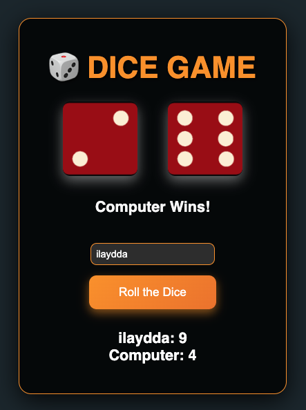

## Ekran Görüntüsü

Aşağıda uygulamanın bir ekran görüntüsü bulunmaktadır:



## Vercel Üzerinde Yayın

Bu uygulama [Vercel](https://vercel.com/) üzerinde yayınlanmıştır. Uygulamayı aşağıdaki bağlantıdan ziyaret edebilirsiniz:

[https://dicegame.vercel.app](dice-game-em6trdbyh-ilayddaas-projects.vercel.app)

# Zar Oyunu

Bu proje, bir zar oyunu uygulamasıdır. Kullanıcılar zar atarak rastgele sonuçlar elde eder ve oyunun kurallarına göre kazanan belirlenir.

## Kullanılan Teknolojiler

- **HTML5**: Uygulamanın temel yapısı için.
- **CSS3**: Görsel tasarım ve stil düzenlemeleri için.
- **JavaScript**: Zar atma işlemleri ve oyun mantığı için.
- **Node.js**: Backend işlemleri için.
- **Vercel**: Uygulamanın dağıtımı için.

## Kurulum

1. Bu projeyi klonlayın:
    ```bash
    git clone https://github.com/kullaniciadi/DiceGame.git
    ```
2. Proje dizinine gidin:
    ```bash
    cd DiceGame
    ```
3. Gerekli bağımlılıkları yükleyin:
    ```bash
    npm install
    ```
4. Uygulamayı başlatın:
    ```bash
    npm start
    ```


## Katkıda Bulunma

Katkıda bulunmak isterseniz, lütfen bir pull request gönderin veya bir issue açın.
